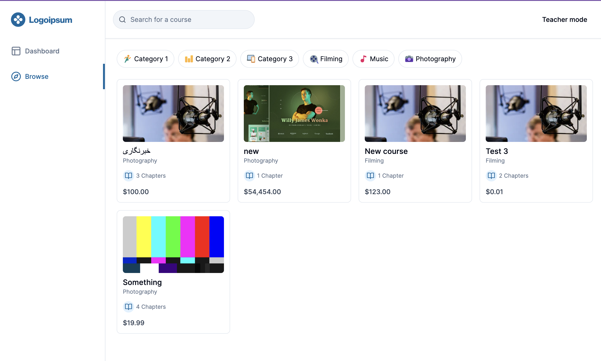

# Edu Academy

Edu Academy is an educational platform that offers online courses on various subjects. It is built with [Next.js](https://nextjs.org/) and [Prisma](https://www.prisma.io/) and aims to provide a seamless learning experience for students and instructors.



## Features

- **User Authentication:** Users can sign up, log in, and manage their accounts securely.
- **Course Management:** Instructors can create, edit, and publish courses with rich content, including text, images, and videos.
- **Course Enrollment:** Students can browse available courses, enroll in them, and track their progress.
- **Interactive Learning:** Courses feature interactive elements such as quizzes, assignments, and discussion forums.
- **Progress Tracking:** Students can track their progress within each course and receive feedback from instructors.
- **Responsive Design:** The application is fully responsive, ensuring a seamless experience across devices.

## Getting Started

To get a local copy up and running follow these simple steps.

### Prerequisites

- Node.js
- npm
- PostgreSQL

### Installation

1. Clone the repo

   ```sh
   git clone https://github.com/yourusername/edu-academy.git
   ```

2. Install NPM packages
   ```sh
   npm install
   ```

### Usage

1. Run the development server
   ```sh
   npm run dev
   ```
2. Open your browser and navigate to `http://localhost:3000`

## Deployment

Deploy your application using Vercel or another hosting platform.

Roadmap
See the open issues for a list of proposed features (and known issues).

Contributing
Contributions are what make the open-source community such an amazing place to learn, inspire, and create. Any contributions you make are greatly appreciated.

Fork the project
Create your feature branch (git checkout -b feature/AmazingFeature)
Commit your changes (git commit -m 'Add some AmazingFeature')
Push to the branch (git push origin feature/AmazingFeature)
Open a pull request
